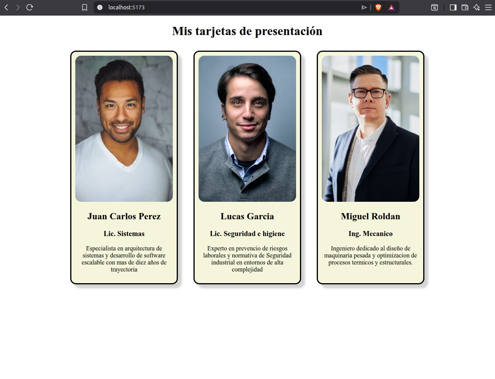
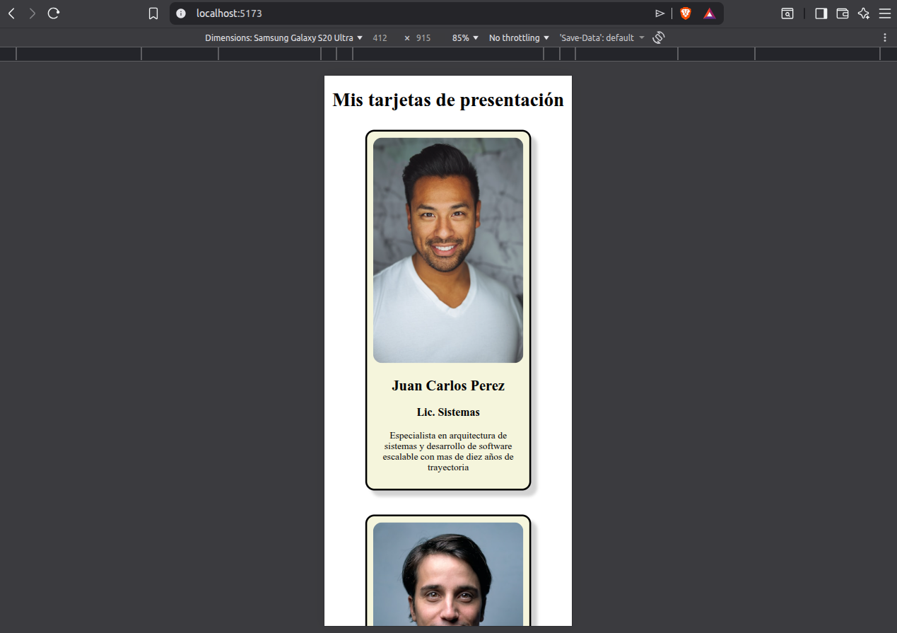

1 🛠️ Descripcion breve del proyecto

# Creacion del proyecto: A modo de documentar todo lo realizado, por unica vez (puesto que se entiende que es una tarea introductoria), se mencionan los pasos realizados para crear el proyecto. 

Se ha abierto una terminal y se ejecutaron los siguientes comandos:

npm create vite@latest utn-react-u4-presentacion

◇  Select a framework:
│  React
│
◇  Select a variant:
│  JavaScript
│
◇  Use Vite 8 beta (Experimental)?:
│  No
│
◇  Install with npm and start now?
│  Yes
│
◇  Scaffolding project in /home/sr-x/Escritorio/utnElearning/Curso React JS/clase4/tarea/utn-react-u4-presentacion...
│
◇  Installing dependencies with npm...

added 156 packages, and audited 157 packages in 12s

33 packages are looking for funding
  run `npm fund` for details

found 0 vulnerabilities
│
◇  Starting dev server...

> utn-react-u4-presentacion@0.0.0 dev
> vite

  VITE v7.3.1  ready in 606 ms

  ➜  Local:   http://localhost:5173/
  ➜  Network: use --host to expose
  ➜  press h + enter to show help

# ingreso a la carpeta del proyecto e instalacion de dependencias:
  
  cd utn-react-u4-presentacion/

  npm install

# Limpiando el ruido: Al borrar archivos que no sean necesarios y dejar limpio el proyecto:

    - Se ha borrado el contenido de App.css e index.css.

    - Se han eliminado los archivos de logos en la carpeta src/assets/ y el archivo eslint.config.js

    - Se ha limpiado App.jsx para que solo quede una estructura básica

# Luego se ha procedido con la implementacion del componente "Tarjeta.jsx" y su estilado correspondiente "Tarjeta.css" en el directorio src/components.
# El siguiente paso fue renderizar las tarjetas en App.jsx (notar que tambien fue estilado con el archivo "App.css").
    
2 🛠️ Intrucciones para clonar, instalar dependencias y ejecutar.

    - Clonar el repositorio.
    - Abrir una terminal en la carpeta del proyecto.
    - Instalar las dependencias:
        npm install
    - Iniciar el servidor de desarrollo:
        npm run dev
    - Verificar funcionamiento en el navegador:
        http://localhost:5173/

3 🛠️ Capturas de pantalla de las tarjetas funcionando

En las siguientes imagenes se puede observar el funcionamiento de las tarjetas y ademas, su comportamiento responsivo (notar que en la segunda imagen las dimensiones de pantalla corresponden a un telefono Samsung Galaxy S20 Ultra):

4 🛠️ Creditos del autor

    - Nombre del estudiante: Javier Gerez
    - Curso: Curso de desarrollo en React JS 181750
    - Unidad: 4 (modulo 1)

5 🛠️ Bibliografia y creditos de imagenes

    - Desarrollo en React JS, React inicial.pdf, Centro de e-learning UTN-BA 
    - Las imágenes utilizadas son de uso libre y fueron obtenidas de Unsplash